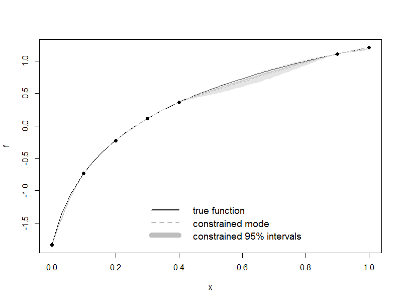

# Kriging with inequality constraints for computer experiments

This repository contains an R Package to build, simulate, predict kriging model using inequality constraints like monotonicity, convexity and boundaries. Kriging model is similar to DiceKriging.

Installation
------------

You can install the latest version of the code using the `devtools` R package.

```{r}
# Install devtools, if you haven't already.
install.packages("devtools")

library(devtools)
install_github("maatouk/constrKriging")
```

Usage
-----

```{r}
## Golchi Example
f <- function(x){
log(20*x+1)
}

design <- c(0, 0.1, 0.2, 0.3, 0.4, 0.9, 1)
response <- f(design)

meany <- mean(response)
f <- function(x){
log(20*x+1)-meany
}

design <- c(0, 0.1, 0.2, 0.3, 0.4, 0.9, 1)
response <- f(design)

model = kmMonotonic1D(design, response, basis.type="C1", covtype="matern5_2",basis.size=40, coef.var=1000, nugget=1e-5)

plot(f)

plot(object=model, median=TRUE, quantiles=TRUE, minmax=FALSE, col='gray',nsim=100, add=T)

points(design,response,pch=19)

legend(0.3,-1.1, c("true function","constrained mode","constrained 95% intervals"),
col = c('black','gray','gray'), text.col = "black",
lty = c(1, 2,1), pch=c(NA_integer_, NA_integer_),
lwd = c(2, 2,10), text.font=1,box.lty=0, cex=1.2)
```




References
---------

Maatouk, H. and Bay, X. (2014a). A New Rejection Sampling Method for Truncated Multivariate Gaussian Random Variables Restricted to Convex Sets. [hal-01063978](https://hal.archives-ouvertes.fr/hal-01063978).

Maatouk, H. and Bay, X. (2014b). Gaussian Process Emulators for Computer Experiments with Inequality Constraints. [hal-01096751](https://hal.archives-ouvertes.fr/hal-01096751).

Maatouk, H., Roustant, O., and Richet, Y. (2015). Cross-Validation Estimations of Hyper-Parameters of Gaussian Processes with Inequality Constraints. [hal-01153960](https://hal.archives-ouvertes.fr/hal-01153960).

Bay, X., Grammont, L., and Maatouk, H. (2015). A New Method for Smothing and Interpolating with Inequality Constraints. [hal-01136466](https://hal.archives-ouvertes.fr/hal-01136466).