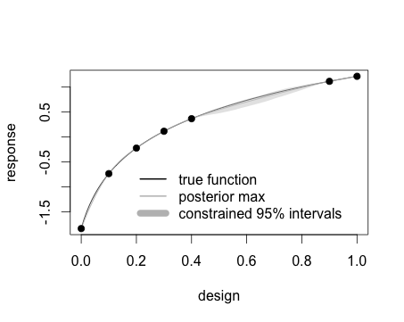

# Kriging with inequality constraints for computer experiments

This repository contains an R Package to build, simulate, predict kriging model using inequality constraints such as boundedness, monotonicity and convexity. Kriging model is similar to DiceKriging.

Installation
------------

You can install the latest version of the code using the `devtools` R package.

```{r}
# Install devtools, if you haven't already.
install.packages("devtools")

library(devtools)
install_github("maatouk/constrKriging")
```

Usage
-----

```{r}
## Golchi Example
f <- function(x){
log(20*x+1)
}

design <- c(0, 0.1, 0.2, 0.3, 0.4, 0.9, 1)
response <- f(design)

meany <- mean(response)
f <- function(x){
log(20*x+1)-meany
}

design <- c(0, 0.1, 0.2, 0.3, 0.4, 0.9, 1)
response <- f(design)

model = kmMonotonic1D(design, response, covtype="matern5_2", basis.size=50, coef.var=355^2, coef.cov=4.37, nugget=1e-7)

plot(f, ylab='response', xlab='design')

plot(object=model, spline=TRUE, quantiles=TRUE, col='gray',nsim=1000, add=T)

points(design,response,pch=19)

legend(0.2,-0.5, c("true function","posterior max","constrained 95% intervals"),
col = c('black','gray','gray'), text.col = "black",
lty = c(1, 1, 1), pch=c(NA_integer_, NA_integer_),
lwd = c(2, 2, 10), text.font=1,box.lty=0)
```




References
---------

Maatouk, H. and Bay, X. (2014). A New Rejection Sampling Method for Truncated Multivariate Gaussian Random Variables Restricted to Convex Sets. In: Nuyens R, Cools R (ed) Monte Carlo and Quasi-Monte Carlo Methods, vol 163. Springer International Publishing, Cham, pp 521–530, preprint http://hal-emse.ccsd.cnrs.fr/FAYOL-ENSMSE/hal-01063978v1.

Maatouk, H. and Bay, X. (2017). Gaussian Process Emulators for Computer Experiments with Inequality Constraints. Mathematical Geosciences. doi:10.1007/s11004-017-9673-2, preprint https://hal.archives-ouvertes.fr/hal-01096751.

Maatouk, H., Roustant, O., and Richet, Y. (2015). Cross-Validation Estimations of Hyper-Parameters of Gaussian Processes with Inequality Constraints. Procedia Environmental Sciences, 27 :38 – 44, 2015. Spatial Statistics conference 2015.

Bay, X., Grammont, L., and Maatouk, H. (2015). A New Method For Interpolating In A Convex Subset Of A Hilbert Space. Submitted, preprint https://hal.archives-ouvertes.fr/hal-01136466.

Bay X., Grammont, L. and Maatouk, H. (2016). Generalization of the Kimeldorf-Wahba Correspondence for Constrained Interpolation. Electronic Journal of Statistics 10(1):1580–1595, preprint http://arxiv.org/abs/1602.02714.

Cousin, A., Maatouk, H. and Rullière, D. (2016). Kriging of Financial Term-Structures. European Journal of Operational Research 255(2):631–648, preprint https://arxiv.org/abs/1604.02237.